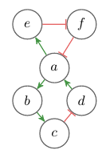
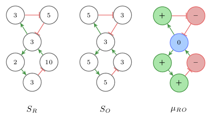
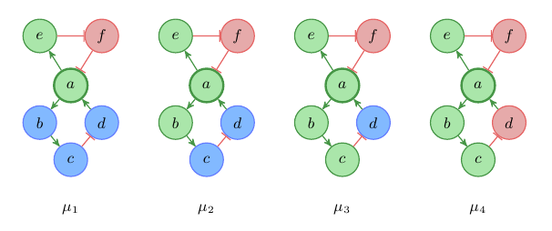
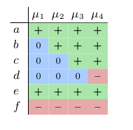
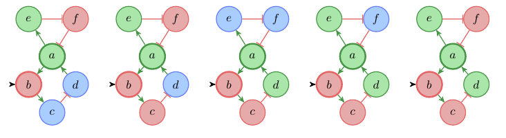
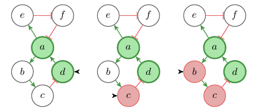
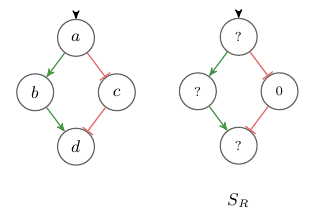
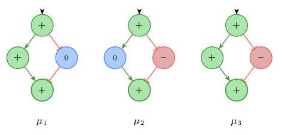

+++
title = "Ultimate sign consistency methods"
date = 2016-05-29
draft = true

#template = "about.html"

[taxonomies]
tags = ["sign-consistency"]
+++

**`This is work in progress! The content is still incomplete and changing.`**

This is the ultimate guide to sign consistency. 
It is a self contained version of my sign consistency series, 
*"Sign consistency methods to reason over the transitional behavior of dynamic systems"*. 

## Motivation

I want to explain how interaction graph models and sign consistency methods are used to model the behavior of dynamical systems. The focus lies on modeling the behavior of biological systems, although the application to artificial systems is possible. In particular, I want to show how certain sign consistency methods work, under which assumption they operate, which biological questions they allow us to answer, and what problems exist. My aim is to be very beginner friendly with lots of examples. OK, let’s dive into it! Here is a table of content that list the covered topics from which you can cherry pick.

## Interaction graphs and signed system changes

This section is introducing interaction graph models and how they are used by sign consistency methods to model the changes in a dynamic system.

### What are interaction graphs?

Interaction or influence graphs are a widely used representation for complex systems. Nodes represent the components or players in the system and edges denote how these components interact with each other. A lot of biological systems have a representation as interaction graph: hunter prey models, gene regulatory networks, signaling networks, etc. Here is a more formal definition.

**Definition 1**: 
*An interaction graph is a signed directed graph (V, E, σ), where
V is a set of nodes,
E is a set of edges, and
σ : E → {+, –} is a labeling of the edges. 
Every node in V represents a state variable in the modeled system and an edge 
i→j means that the change of i in time influences the value of j. 
Every edge i→j of an interaction graph can be labeled with a sign, 
either + or –, denoted by σ(i,j),
where + (–) indicates that i tends to increase (decrease) j.*

An example of an interaction graph is given in Figure 1. There exist many variants of interaction graphs some have weighted edges and some have other kind of edges or different types of nodes. But with this definition we will come pretty far.

**Fig. 1**: Example of an interaction graph. Green arrows indicate positive (+) influence, red edges negative (–) influence.

### What are signed system changes?

Interaction graphs are an abstraction of dynamic quantitative systems where a quantitative state of the system is a mapping *Si : V → ℝ+*.
Sign consistency methods use signs to denote changes in the variables of the modeled system. 
Examples for such changes could be increased or decreased in metabolite concentrations or expression levels of genes. 
The signs *+* and *–* are used to denote *increase* and *decrease* and *0* signifies *no-change*. 
Sign consistency methods relate the IG model of the system and the variations in between system states by representing the variations as labels on the nodes in the graph. 
For example, the changes between two states of the system can be represented as a sign labeling of the IG. 
Given two system states *SR* and *SO* the differences between these states can be represented as the labeling *μRO : V →{+,–,0}* with *μRO(x) = sign(xSO} - xSR)*. 
See Figure 2 for an example of two states and the corresponding sign labeling.
We use the colors 
&nbsp;&nbsp;&nbsp;&nbsp;,
&nbsp;&nbsp;&nbsp;&nbsp;,
&nbsp;&nbsp;&nbsp;&nbsp; to represent the signs *+*, *–*, *0*.

**Fig. 2**: Example of a sign labeling representing the changes between two quantitative states.

### Sign consistency rules - Rule 1 (backwards propagation)

Further, sign consistency methods define rules that determine which labelings of the graph are considered consistent and which are considered inconsistent. There exist several different consistency rules which are useful to model different properties of a biological system. For now we only consider the following.

**Rule 1 (backwards propagation)**: Every change in a node must be explained by a change in one of its predecessors.
*Let (V,E,σ) be an IG. Then a labeling μ : V →{+,–,0} satisfies Rule 1 for node i ∈ V iff*
+ *μ(i) = 0, or*
+ *there is some edge j→i in E such that μ(i) = μ(j)σ(j,i).*

*Rule 1* implements backward reasoning. 
Given an effect we look backwards to verify its cause. 
Labelings that are consistent with this rule represent the differences between steady states. 
In a steady state the values of all state variables are balanced. 
Hence, the change in one variable must be sustained by the change in one of its predecessors. 
In other words, if *SR* and *SO* are steady states of the system then the labeling *μRO* is consistent with *Rule 1*. 
The trivial example is when both state are the same *SR = SO* then nothing changes *∀x ∈ V : μRO(x) = 0*.

Let’s see what else we can do with that. 
*Figure 3* shows an interaction graph and all labelings *μi : V →{+,–,0}* with *μi(a) = +* that satisfy *Rule 1*.

**Fig. 3**: Labeled interaction graph

Often it is useful to represent the labelings in a table as shown in *Table 1*.
As you can see, there exist only four labelings that satisfy these constraints. 
In every of these labeling it holds *μi(e) = +* and *μi(f) = –*.
We can use this table to predict the behavior of the system. 
We see that in every steady state, with an increase in a we also have an increase in *e* and a decrease in *f*.
For *b* and *c* we can predict that they will not decrease, and for *d* that it will not increase.

**Table 1**: Table of admissible labelings.

## Predicting system responses to perturbations

We have seen how sign consistency methods represent variations in the system as sign labelings,
and how sign consistency constraints can be used to derive predictions over the steady states of a system. So far we have modeled a closed system. 
In this section I will introduce external inputs and perturbations. 

### Inputs and perturbations

Most systems interact in some ways with a surrounding context i.e. their environment. 
The interface to the environment is provided by variables which are not controlled by the modeled system itself but externally. 
We call variables in our system which are controlled externally *inputs* and 
we denote the set of nodes that represent input variables with *I ⊆ V*. 
Because input nodes are controlled externally,
they are excluded from the sign consistency rules.

For the closed system shown in *Figure 1*, there exists no single labeling *μ : V→{+,–,0}*, with *μ(a) = + and μ(b) = –* that satisfies *Rule 1* for all *v ∈ V*.
In other words, there exists no transition between steady states where *a* increases and *b* decreases. 
Because *a* is the only predecessor of *b*, between all steady states changes in *a* and *b* must have the same sign.

**Fig. 1**: Example of an interaction graph. Green arrows indicate positive (+) influence, red edges negative (–) influence.

We can interpret our model as an open system,
were the value of *b* is determined by the environment by declaring *b* as input variable.
With perturbations we can now take control over the input variables and find out how the system behaves under different environmental conditions. 
For example we can now find out how our system reacts to a decrease in *b*. *Figure 2* shows all labelings *μi* that satisfy *Rule 1* for all *v ∈ V \ I* with *I = {b}* and *μi(a) = + and μi(b) = –*.
Input nodes are denoted with a black incoming arrow.

**Fig. 2**: Labeled interaction graph

We see that using a perfect perturbation, a sustained decrease of *b*,
the system can reach a quasi steady state where both *a* and *d* are increased. 
This is a state which could not be reached in the closed system without perturbation.
While this is already an interesting reasoning mode, it is even more interesting to flip the question around and use this approach to do some treatment planning.
Let’s see, what are the minimal perturbations that would allow the system to transition into a state where *a* and *d* are increased?
*Figure 3* shows the potential perturbations (along with partial labelings) that allow for such a state-transition.
We can see that we have two more alternatives to reach our goal, either a direct increase in *d* or a decrease in *c*.

**Fig. 3**: Minimal perturbations of the system that can results in an increase of *a* and *d* (along with partial labeling)

### Perturbations and model topology

Perturbations play a major role in the analysis of biological models. 
A complementary view point on perturbations is that they allow us to alter the model structure. 
In particular, all incoming edges of an input node can be ignored because the node is no longer constrained by the system but by us. 
A special role play so called *0-perturbations*, these are perturbations were the value of a variable is kept *constant over the state transition*.
For those nodes the only possible label is *0* and we can ignore their outgoing edges because they can’t be responsible for any downstream changes.
It’s easy to see that for complex models with many cyclic interactions such perturbations are very useful to investigate the influence of single components while excluding the influence of others. 
Later, we will see how perturbations are used to design experiments that allow to discriminate among alternative model topologies.

## Minimum and maximum level constraints

In this section I will introduce a new rule that discards solutions that violate minimum and maximum constraints on system variables. 

### Constrained values for system variables - Rule 2 (obey minima/maxima)

A lot of variables in biological systems have minimum (resp. maximum) constraints. 
Concentration level cannot go below 0 or above 100%, and signals which are below the detection threshold cannot drop any further. 
Figure *1* shows an IG with 4 variables *a*, *b*, *c* and *d*.
Lets say the variable *c* represent a concentration and only values in the range of 0 to 100 are valid.
Further, we know that in our reference state *SR* the variable *c* is at its minimum. 
Let’s try to find all labelings *μi* that represent transisitions from *SR* to a state *Si* where the level of *d* has increased, *μi(d) = +*.
Figure *2* shows all labelings *μi* that satisfy consistency *Rule 1*.
The labelings *μ2* and *μ3* violate the the minimality constraint on variable *c*,
because there exists no value for *c* in [0,100] such that *sign(c - 0) = –*.

**Fig. 1**: An IG and with the reference state *SR* where variable c *on* its minimum.

**Fig. 2**: All labelings *μi* with *μi(d) = +* that satisfy *Rule 1*. Only *μ1* is consistent with the value restrictions of variable *c*.

To deal with minimum (resp. maximum) constraints we introduce a new consistency rule.

**Rule 2 (obey minima/maxima)**: A variable that is on its minimum cannot decrease and an variable at its maximum cannot increase.
*Let (V,E,σ) be an IG, MIN ⊆ V variables that are at their minimum, and MAX ⊆ V variables that are at their maximum. Then a labeling μ : V →{+,–,0} satisfies Rule 2 for node i ∈ V iff*
+ *μ(i) = 0, or*
+ *μ(i) = –, and i∉MIN or*
+ *μ(i) = +, and i∉MAX.*

*Rule 2* allows us to exclude solutions that violate the constraints on minimal/maximal values.
In *Figure 2* only labeling *μ1* satisfies both consistency rules *1* and *2*.

We now have a consistency rule that allows us to filter solutions that violate constraints restricting the minimum or maximum level of system variables. 
This rule can be combined with other consistency rules to get better explanations for state transitions.
In the next part I will introduce another consistency rule that increases the predictive power of sign consistency methods. 
